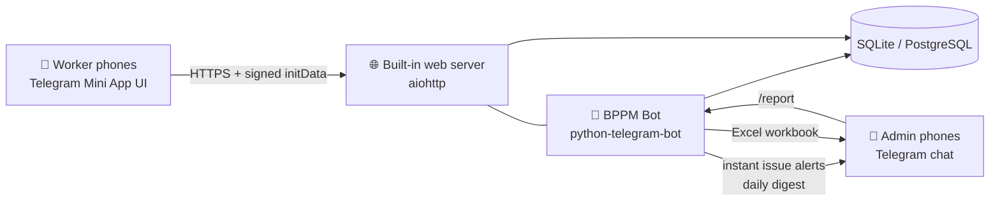

# BPPM — Pump Maintenance Telegram Mini App

A Telegram **Mini App** for daily **Booster Pump Preventive Maintenance
(BPPM)** data collection across **72 pump houses**, replacing paper checklists.
Workers open a real app UI inside Telegram — pump house list with search,
tappable checklist, camera photos for defects — and submit in a few taps. The
system stores everything in a database and generates the monthly work report
automatically, so the admin never compiles it by hand.

Two surfaces share one brain:

- **The Mini App** (`webapp/`) — the worker's UI, opened from the bot's
  "Open App" menu button. Telegram requires an HTTPS URL for this; the bot
  ships with a built-in web server you put behind any HTTPS proxy.
- **The bot chat** — registration/approval, instant issue alerts to admins,
  the daily digest, `/report` Excel export, and a full chat-based checklist
  flow as a fallback when the app URL isn't configured.

---

## 1. Why a Telegram Mini App (not a standalone app)

- Workers already have Telegram — nothing to install, no app store, no logins.
  Identity comes from Telegram itself (cryptographically signed `initData`),
  so there are no passwords to manage or forget.
- Mini Apps give a real UI (lists, search, progress bars, bottom sheets)
  while still living inside Telegram, matching the user's theme.
- Photos of defects are first-class: tap → camera → attached.
- Everything runs on one small server; the database is yours.

## 2. The people

| Role | What they do |
|---|---|
| **Site worker** | Runs `/new`, picks the pump house, ticks the checklist, flags issues with photo + note, submits. |
| **Admin** | Approves new workers, receives instant issue alerts and a daily digest, pulls the monthly Excel report with `/report`. |

New workers self-register with their name; an admin taps **Approve** before they
can submit anything, so random people can't inject data.

## 3. The key UX idea: "All OK" first, exceptions second

On a normal day almost every check passes. Making a worker tap 52 individual
boxes per pump house would kill adoption. So the app is built around
**exception reporting**:

1. **Home menu** — choose the work type: **🔧 Preventive Maintenance**
   (active) or **🚨 Emergency Work** (shown greyed out, "Coming soon" —
   reserved for the next phase).
2. **Station list** — all 72 pump houses with a monthly coverage bar
   (`1/72`), a search box (`23` or `likas` both work), and a status chip per
   station: ✅ done this month, or "Due".
3. **Checklist screen** — the equipment categories as cards, each with an
   **✅ All OK** button that answers every remaining task in the card with
   one tap. Individual tasks have a three-way control: **OK / Issue / N/A**.
4. **Recording sheet** — tapping **OK** or **Issue** slides up a bottom
   sheet. Its contents are defined per task like an M&E service sheet
   (section 5): tasks with measurable outputs show **typed reading fields
   with the expected unit** (e.g. Current L1/L2/L3 in A, insulation
   resistance in MΩ); pure visual checks are static-text confirmations with
   no value fields.
5. **Mandatory photo evidence** — every OK requires all three work-proof
   photos: **Before, During, After** (e.g. alignment: as found, while
   setting, as left). Every Issue requires a description plus at least the
   **Before** (defect-found) photo; During/After are added when rectified.
   The camera opens directly per slot. **N/A saves instantly — no value or
   photo asked.** Both the app and the server enforce these rules; an
   inspection cannot be submitted with missing readings or photo slots.
6. **Submit** — the bottom button stays disabled showing progress
   (`Answer all tasks (21/52)`) until everything is answered, then becomes
   **📤 Submit inspection** with a confirmation dialog.

Answers save to the phone as the worker goes — closing Telegram or losing
signal loses nothing; reopening the same pump house restores the half-done
checklist. (The earlier bulk "All OK" shortcut was removed deliberately:
every OK now carries its readings and B/D/A photos, which is the point of
the evidence policy.)

### App screens

| Home | Checklist | Issue sheet | Submitted |
|---|---|---|---|
| 72 stations, coverage bar, search, status chips | Category cards, All OK button, OK/Issue/N/A per task, progress bar | Note + camera photo, slides over the list | Counts recap, straight to the next station |

(Screenshots of every screen are in the published design page; the flow was
verified end-to-end in a real browser during development.)

## 4. Smart scheduling — the bot knows what's due

The BQ defines four frequencies: **Monthly, Three Monthly, Six Monthly,
Yearly**. Workers never track this — when an inspection starts, the bot
computes what is due *at that pump house, today*:

- A **Monthly** task is due unless already completed (OK) this calendar month.
- A **3M/6M/Yearly** task is due when its last OK completion is ≥ 3/6/12
  months old — or has never been recorded.

So most visits show the 44 monthly tasks, and every third/sixth/twelfth month
the periodic checks (pump alignment, earth impedance, relay settings, flowmeter
accuracy verification…) automatically appear in the same list, labelled with
their frequency. Nothing is ever forgotten, and nothing is asked twice.

Selecting an already-fully-serviced pump house says "🎉 Nothing is due" —
useful proof of completion in the field.

## 5. The checklist (digitized from BQ Bill U2)

10 equipment categories, 52 tasks, stored in `data/checklists.json` so the
admin can edit tasks — including their expected readings and units — without
touching code. Measured tasks carry an M&E input spec:

| Task | Expected readings (units) |
|---|---|
| Discharge & suction pressure | Suction, Discharge (bar) |
| Abnormal flow | Flow rate (m³/h) |
| Abnormal vibration (pump & motor) | Vibration velocity (mm/s RMS) |
| Pump/drive alignment (3M) | Radial, Axial misalignment (mm) |
| Power cable test | Insulation resistance (MΩ) |
| Motor amp | Current L1, L2, L3 (A) |
| Supply voltage | Voltage L1-L2, L2-L3, L3-L1 (V) |
| Bearing grease top-up | Grease added (g, 0 if none) |
| Electrical measurement meters (3M) | Panel voltmeter (V), ammeter (A) |
| Protection relay (Y) | Settings verified (type/setting) |
| Earth impedance (6M) | Earth impedance (Ω) |
| Altitude valve level (3M) | Set level (m) |
| Flowmeter accuracy (Y) | Reference flow, meter reading (m³/h), error (%) |

All remaining tasks (bolts, noise, seals, cleaning, terminations, lights…)
are static-text checkboxes — no reading, but still full B/D/A photo proof.

Category/task structure:

| # | Category | Tasks | Non-monthly |
|---|---|---|---|
| 1 | Booster Pump | 11 | alignment check (3M) |
| 2 | Booster Pump Motor | 10 | — |
| 3 | Pump Station's Pipework | 3 | — |
| 4 | Butterfly / Sluice Valve | 3 | — |
| 5 | Altitude Valve (Suction Tank & Reservoir) | 5 | level setting & calibration (3M) |
| 6 | Surge Anticipating Valve | 2 | — |
| 7 | Non-Return Valve | 2 | — |
| 8 | Strainer | 2 | — |
| 9 | Electrical Switchboard (incl. VFD) | 10 | meters (3M), cable termination (3M), earth impedance (6M), control sequence (6M), protection relay (Y) |
| 10 | Electromagnetic Flowmeter | 4 | accuracy verification (Y) |

Task numbering matches the BQ document exactly so generated reports line up
with the contract.

The 72 pump houses (BPH01 KOPUNGIT 1 … BPH72 TELIPOK) live in
`data/pump_houses.json`.

## 6. Accounts, login & security

Every worker has their own account, and strangers cannot reach the data:

- **Login is Telegram itself.** There are no passwords: every API request
  carries Telegram's signed `initData`, and the server verifies the HMAC
  against the bot token (`bot/webapp_auth.py`). Identity cannot be spoofed,
  requests expire after 24 h, and the API is unusable from outside Telegram —
  anyone hitting the URL directly gets `401 Unauthorized`.
- **Admin approval gate.** A new worker registers with their name and is
  held in "pending" until an admin taps **Approve** in Telegram. Until then
  every endpoint (stations, checklist, photo upload, submit) returns
  `403 Forbidden` — a stranger who somehow opens the app can't upload
  anything.
- **Per-worker audit trail.** Every inspection and photo is tied to the
  approved worker's Telegram ID and name, so reports show who did what.
- **Server-side validation.** Submissions are checked against the
  currently-due task set — a stale or tampered client can't write arbitrary
  rows. Photo uploads are size-capped and require an approved account.
- Rejecting or un-approving a worker (admin **Reject**) immediately cuts
  their access.

## 7. Data model

SQLite by default (zero setup, one file, trivially backed up); the schema is
plain SQL and ports to PostgreSQL unchanged if you outgrow it.

```
workers            telegram_id PK, name, is_admin, approved, created_at
pump_houses        code PK (BPH01…BPH72), name
inspections        id PK, pump_house FK, worker_id FK,
                   status (draft|submitted|cancelled), started_at, submitted_at
inspection_items   inspection_id FK, category, task_id, freq,
                   result (ok|issue|skipped|NULL), note, photo_file_id
```

- Every answer is a row — full audit trail of who checked what, when.
- Photos: Mini App uploads are saved under `photos/` and referenced as
  `local:<file>`; photos sent in the chat flow are stored as Telegram
  `file_id`s. Both kinds are pushed to admins in issue alerts.
- App drafts persist on the worker's phone; chat-flow drafts persist in the
  database — either way an unfinished inspection survives interruptions.

## 8. Reporting — the admin does nothing

**Instant:** every submitted issue is pushed to all admins immediately, with
notes and photos.

**Daily:** at 18:00 site time, admins get a digest — pump houses covered this
month (x/72), issues so far, and the list of stations not yet visited.

**Monthly:** `/report` (or `/report 2026-08`) generates an Excel workbook:

| Sheet | Contents |
|---|---|
| **Summary** | One row per pump house (all 72): inspected yes/no, date, worker, OK/issue/skip counts. Color-coded — green OK, red has issues, orange not visited. |
| **Issues** | Every issue in the month: date, station, category, task, worker's note, photo flag, worker. |
| **Details** | Every recorded task result — the full BPPM evidence trail matching the BQ checklist, for contract claims. |

`/status` shows the same coverage numbers on demand, any time.

## 9. Architecture



- **One process**: Python 3.11+, `python-telegram-bot` v21 (async) for the
  bot + `aiohttp` serving the Mini App UI and JSON API, `openpyxl` for Excel.
- The frontend is dependency-free vanilla HTML/JS/CSS (`webapp/`) using
  Telegram's theme variables — it matches each worker's light/dark theme
  automatically. No build step.
- The bot side uses long polling; only the Mini App needs an HTTPS URL —
  point a reverse proxy, Cloudflare Tunnel, or ngrok at the local port.
  Without `WEBAPP_URL` set, everything still works chat-only.
- Single process, one SQLite file; back up = copy one file (plus `photos/`).

## 10. Future extensions (not built yet, schema-ready)

- **Numeric readings** — motor amps, supply voltage, pressures as typed values
  with out-of-range alerts (the `note` field already captures them free-text).
- **GPS check-in** — request location on pump-house selection to verify
  presence on site.
- **Issue lifecycle** — admin marks issues rectified; report gains an
  "outstanding defects" sheet.
- **PDF service sheets** — per-station monthly PDF in the exact BQ layout for
  contract submission.
- **Multiple contracts/zones** — add a `zone` column to `pump_houses` and
  filter menus per worker.
