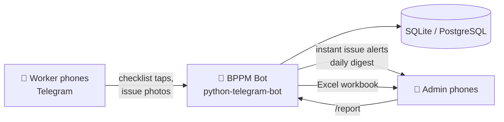

# BPPM Bot — Pump Maintenance Telegram App

A Telegram bot for daily **Booster Pump Preventive Maintenance (BPPM)** data
collection across **72 pump houses**, replacing paper checklists. Workers record
inspections from their phone in a few taps; the system stores everything in a
database and generates the monthly work report automatically, so the admin never
compiles it by hand.

---

## 1. Why a Telegram bot (not a custom app)

- Workers already have Telegram — nothing to install, no app store, no logins.
- Works on any phone, on weak mobile data (messages are tiny).
- Photos of defects are first-class: snap → send, done.
- The bot runs on one small server; the database is yours.

## 2. The people

| Role | What they do |
|---|---|
| **Site worker** | Runs `/new`, picks the pump house, ticks the checklist, flags issues with photo + note, submits. |
| **Admin** | Approves new workers, receives instant issue alerts and a daily digest, pulls the monthly Excel report with `/report`. |

New workers self-register with their name; an admin taps **Approve** before they
can submit anything, so random people can't inject data.

## 3. The key UX idea: "All OK" first, exceptions second

On a normal day almost every check passes. Making a worker tap 52 individual
boxes per pump house would kill adoption. So the flow is built around
**exception reporting**:

1. Pick the pump house (tap from list, or type `23` / `likas` to search).
2. The bot shows the 10 equipment categories with live progress counters.
3. Open a category → tap **✅ All remaining OK** → done in one tap.
4. Only when something is wrong: tap that task → **⚠️ Issue** → type what's
   wrong (optionally send a photo with the text as caption).
5. When all categories show ✅ → **Review & Submit**.

A fully-OK inspection is **~12 taps total**. An unfinished inspection is saved
as a draft — the worker can close Telegram, drive to the next site, and `/new`
offers to resume.

### Conversation mockup

```
Worker: /new
Bot:    🏠 Which pump house?
        Tap below, or type its number/name to search.
        [BPH01 · KOPUNGIT 1]
        [BPH02 · KOPUNGIT 2]
        ... [⬅️ Prev] [1/9] [Next ➡️]

Worker: 23
Bot:    🔧 BPH23 · SIGNAL HILL LIKAS
        Progress: 0/44 tasks
        📅 Includes due periodic checks: Three Monthly
        [⚙️ Booster Pump · 0/11]
        [🔌 Booster Pump Motor · 0/10]
        [🚰 Pump Station's Pipework · 0/3]
        ...
        [📋 Review & Submit] [🗑 Cancel]

Worker: (taps ⚙️ Booster Pump)
Bot:    ⚙️ Booster Pump
        [⬜ 1. Check any abnormal of discharge & suction…]
        [⬜ 2. Check any abnormal flow]
        ...
        [✅ All remaining OK]
        [⬅️ Back to categories]

Worker: (taps task 6, then ⚠️ Issue)
Bot:    ⚠️ Check leakage of mechanical seal
        Describe the issue in one message. To include a
        photo, send the photo with your description as
        its caption.

Worker: 📷 (photo) "Seal weeping at pump 2, ~1 drip/sec"
Bot:    ⚠️ Issue recorded.   → back to overview

Worker: (…All OK on the rest, then Review & Submit)
Bot:    📋 Summary — BPH23 · SIGNAL HILL LIKAS
        ✅ OK: 43   ⚠️ Issues: 1   ⏭ Skipped: 0
        Issues found:
        • Booster Pump: Check leakage of mechanical seal — Seal weeping…
        [📤 Submit inspection]

Bot →   (to every admin, instantly)
        ⚠️ Issues at BPH23 · SIGNAL HILL LIKAS
        Reported by Ali, 2026-08-12 10:41
        • Booster Pump: Check leakage of mechanical seal
          📝 Seal weeping at pump 2, ~1 drip/sec
        📷 (photo follows)
```

## 4. Smart scheduling — the bot knows what's due

The BQ defines four frequencies: **Monthly, Three Monthly, Six Monthly,
Yearly**. Workers never track this — when an inspection starts, the bot
computes what is due *at that pump house, today*:

- A **Monthly** task is due unless already completed (OK) this calendar month.
- A **3M/6M/Yearly** task is due when its last OK completion is ≥ 3/6/12
  months old — or has never been recorded.

So most visits show the 44 monthly tasks, and every third/sixth/twelfth month
the periodic checks (pump alignment, earth impedance, relay settings, flowmeter
accuracy verification…) automatically appear in the same list, labelled with
their frequency. Nothing is ever forgotten, and nothing is asked twice.

Selecting an already-fully-serviced pump house says "🎉 Nothing is due" —
useful proof of completion in the field.

## 5. The checklist (digitized from BQ Bill U2)

10 equipment categories, 52 tasks, stored in `data/checklists.json` so the
admin can edit tasks without touching code:

| # | Category | Tasks | Non-monthly |
|---|---|---|---|
| 1 | Booster Pump | 11 | alignment check (3M) |
| 2 | Booster Pump Motor | 10 | — |
| 3 | Pump Station's Pipework | 3 | — |
| 4 | Butterfly / Sluice Valve | 3 | — |
| 5 | Altitude Valve (Suction Tank & Reservoir) | 5 | level setting & calibration (3M) |
| 6 | Surge Anticipating Valve | 2 | — |
| 7 | Non-Return Valve | 2 | — |
| 8 | Strainer | 2 | — |
| 9 | Electrical Switchboard (incl. VFD) | 10 | meters (3M), cable termination (3M), earth impedance (6M), control sequence (6M), protection relay (Y) |
| 10 | Electromagnetic Flowmeter | 4 | accuracy verification (Y) |

Task numbering matches the BQ document exactly so generated reports line up
with the contract.

The 72 pump houses (BPH01 KOPUNGIT 1 … BPH72 TELIPOK) live in
`data/pump_houses.json`.

## 6. Data model

SQLite by default (zero setup, one file, trivially backed up); the schema is
plain SQL and ports to PostgreSQL unchanged if you outgrow it.

```
workers            telegram_id PK, name, is_admin, approved, created_at
pump_houses        code PK (BPH01…BPH72), name
inspections        id PK, pump_house FK, worker_id FK,
                   status (draft|submitted|cancelled), started_at, submitted_at
inspection_items   inspection_id FK, category, task_id, freq,
                   result (ok|issue|skipped|NULL), note, photo_file_id
```

- Every answer is a row — full audit trail of who checked what, when.
- Photos are stored as Telegram `file_id`s (no disk space needed; retrievable
  via the Bot API at report time).
- Drafts live in the same table, so unfinished inspections survive bot
  restarts and phone reboots.

## 7. Reporting — the admin does nothing

**Instant:** every submitted issue is pushed to all admins immediately, with
notes and photos.

**Daily:** at 18:00 site time, admins get a digest — pump houses covered this
month (x/72), issues so far, and the list of stations not yet visited.

**Monthly:** `/report` (or `/report 2026-08`) generates an Excel workbook:

| Sheet | Contents |
|---|---|
| **Summary** | One row per pump house (all 72): inspected yes/no, date, worker, OK/issue/skip counts. Color-coded — green OK, red has issues, orange not visited. |
| **Issues** | Every issue in the month: date, station, category, task, worker's note, photo flag, worker. |
| **Details** | Every recorded task result — the full BPPM evidence trail matching the BQ checklist, for contract claims. |

`/status` shows the same coverage numbers on demand, any time.

## 8. Architecture



- **Python 3.11+**, `python-telegram-bot` v21 (async), `openpyxl` for Excel.
- Long polling — no public IP, domain, or TLS certificate needed; runs on any
  RM20/month VPS or an office PC.
- Single process, one SQLite file; back up = copy one file.

## 9. Future extensions (not built yet, schema-ready)

- **Numeric readings** — motor amps, supply voltage, pressures as typed values
  with out-of-range alerts (the `note` field already captures them free-text).
- **GPS check-in** — request location on pump-house selection to verify
  presence on site.
- **Issue lifecycle** — admin marks issues rectified; report gains an
  "outstanding defects" sheet.
- **PDF service sheets** — per-station monthly PDF in the exact BQ layout for
  contract submission.
- **Multiple contracts/zones** — add a `zone` column to `pump_houses` and
  filter menus per worker.
